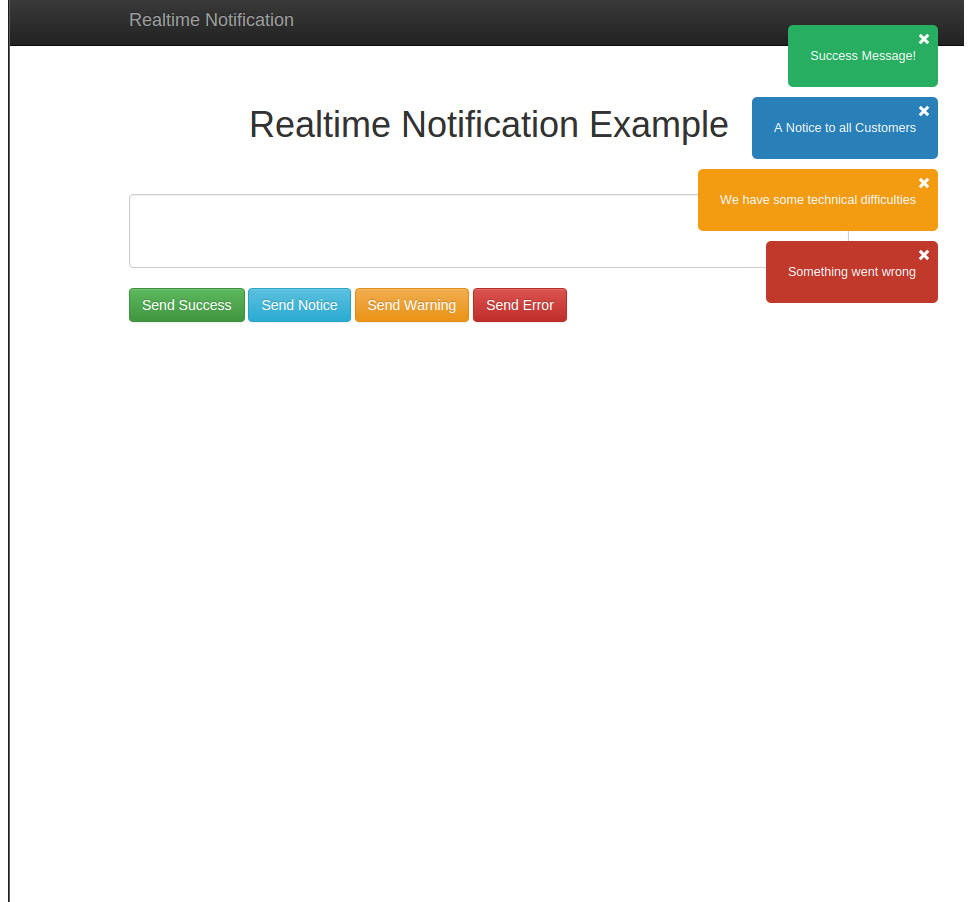

# Realtime Notification Example

Simple Realtime Notification Example using Socket.io.

Register for Notifications on Client Side and send Notifications from Client or Server side.



## How to use it

Clone this repository and run the following shell commands afterwards:

```shell
npm install
```

```shell
bower install
```

### Running the app

Run the following shell commands:

```shell
node app.js
```

## Contact

You can find more angularjs and node examples on my homepage.

http://www.virtualgeek.eu
